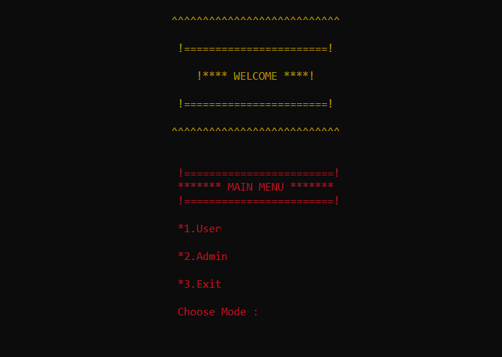
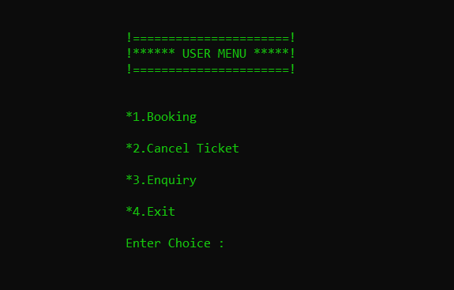
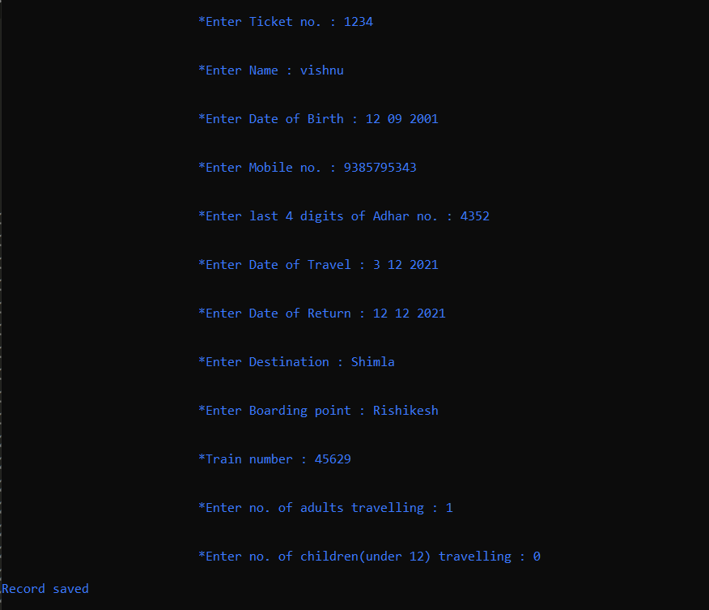
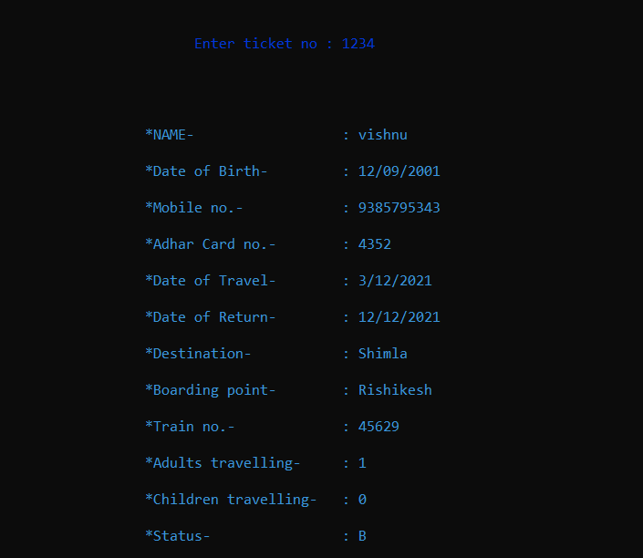
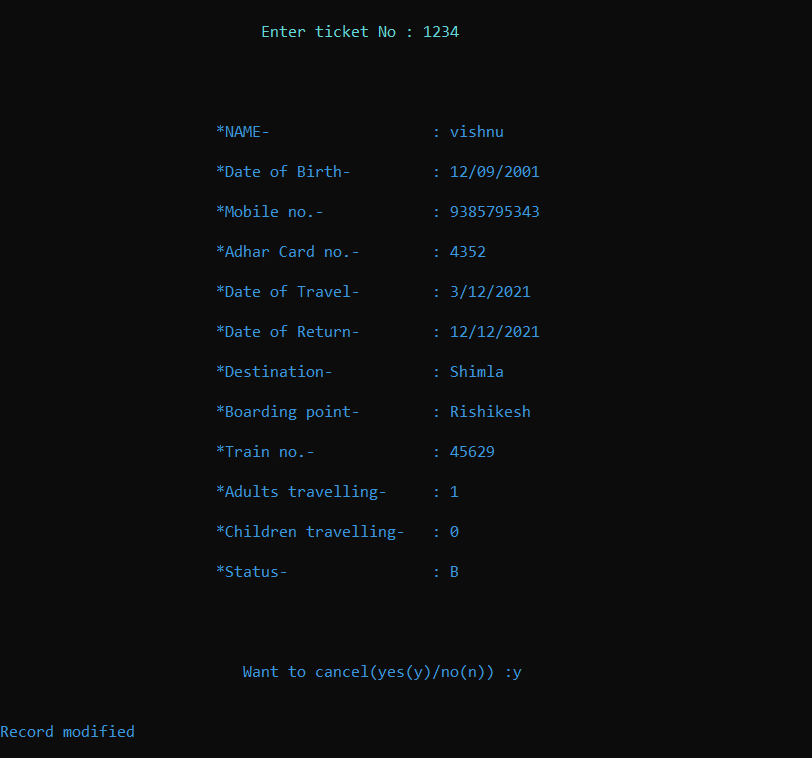
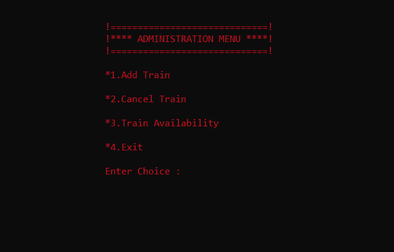
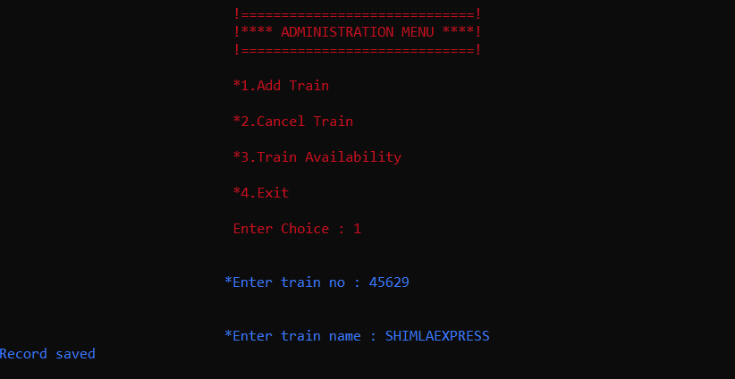
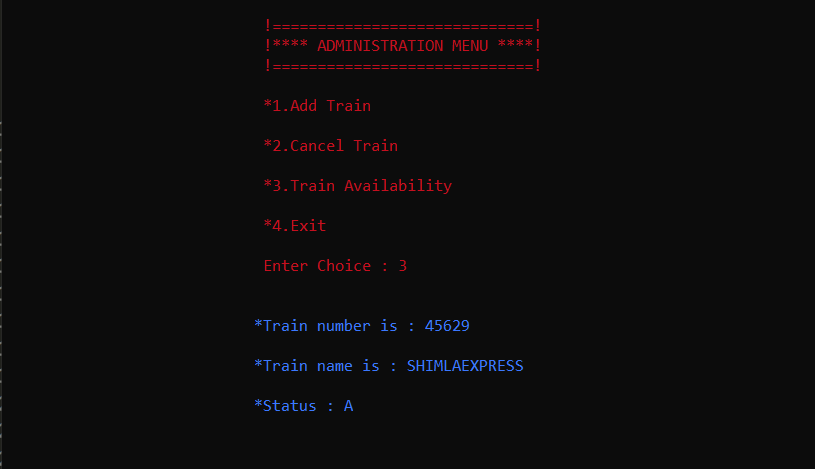
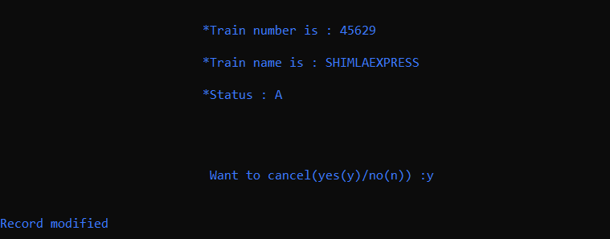
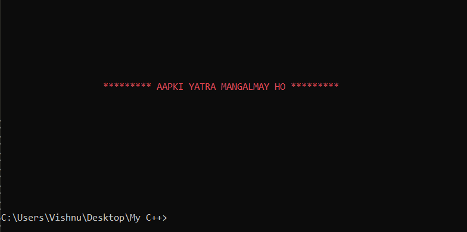

# Railway Reservation System

This is a program written in C++ which adds and display train enquiries and reservation details.
It has two modes: User mode and Administration mode.

## Project View

Here are some screenshots of vairous menus in the project

<------------------------------------------------------------------------>

### Main Menu

<------------------------------------------------------------------------>

### User Menu

<------------------------------------------------------------------------>

### Booking Menu

<------------------------------------------------------------------------>

### Ticket Enquiry Menu

<------------------------------------------------------------------------>

### Ticket Cancel Menu

<------------------------------------------------------------------------>

### Admin Menu

<------------------------------------------------------------------------>

### Add Train Menu

<------------------------------------------------------------------------>

### Train Availability Menu

<------------------------------------------------------------------------>

### Cancel train Menu

<------------------------------------------------------------------------>

### Exit Menu

<------------------------------------------------------------------------>

